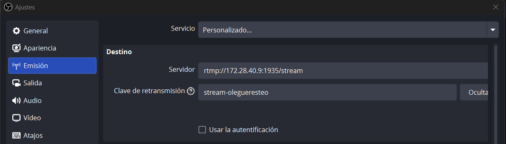
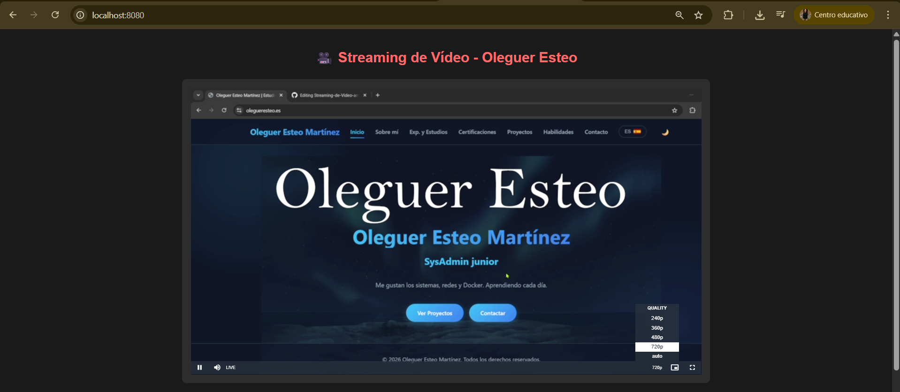
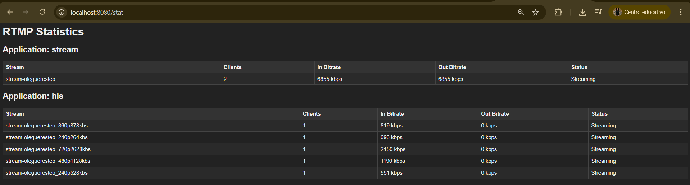
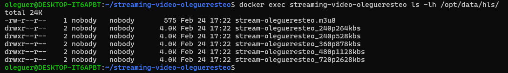

# Streaming Adaptatiu amb Nginx-RTMP & Docker

<p align="center">
  
  
  
</p>

Aquest repositori conté la configuració necessària per desplegar un servidor de streaming de vídeo que rep un senyal via **RTMP**, realitza **transcoding** en temps real i el serveix mitjançant **HLS** (HTTP Live Streaming) amb suport per a múltiples qualitats (adaptatiu).

---

## Requisits

- [Docker](https://www.docker.com/) i Docker Compose.
- [OBS Studio](https://obsproject.com/) per a la transmissió del senyal.
- Navegador web modern (Chrome, Firefox, Edge).

---

## Instal·lació i Desplegament

1. **Clona el repositori:**
```bash
 git clone [https://github.com/joysantalola/Streaming-de-Video-amb-Nginx-RTMP-i-Docker)
 cd Streaming-de-Video-amb-Nginx-RTMP-i-Docker
```


2. **Aixeca els contenidors:**
```bash
docker-compose up -d
```


3. **Verifica l'estat dels serveis:**
```bash
docker ps
```
---


## Configuració de l'Emissió (OBS)

Per començar a emetre, configura el teu codificador (OBS Studio) amb els següents paràmetres:

| Ajust | Valor |
| --- | --- |
| **Tipus d'emissió** | Servidor personalitzat |
| **URL del servidor** | `rtmp://IP:1935/stream` |
| **Clau de transmissió** | `stream-olegueresteo` |

---


## Verificació i Estadístiques

### Reproducció Web

Pots accedir al reproductor a `http://localhost:8080`. El sistema detecta automàticament les variants de qualitat:


### Panell de Control

Monitoritza el bitrate i els usuaris connectats en temps real:
--> [http://localhost:8080/stat](https://www.google.com/search?q=http://localhost:8080/stat)


### Comprovació de fitxers HLS

Si vols verificar que el servidor està generant els segments de vídeo correctament:

```bash
docker exec streaming-video-olegueresteo ls -lh /opt/data/hls/

```

---


## Estructura del Projecte

```bash
.
├── docker-compose.yml   # Definició dels serveis i volums
├── nginx.conf           # Configuració del servidor i transcoding
├── html/
│   ├── index.html       # Reproductor Video.js personalitzat
│   └── stat.xsl         # Full d'estils per a les estadístiques
├── hls/                 # Fitxers de vídeo generats (ignorat per git)
└── img/                 # Captures de pantalla de la documentació

```
